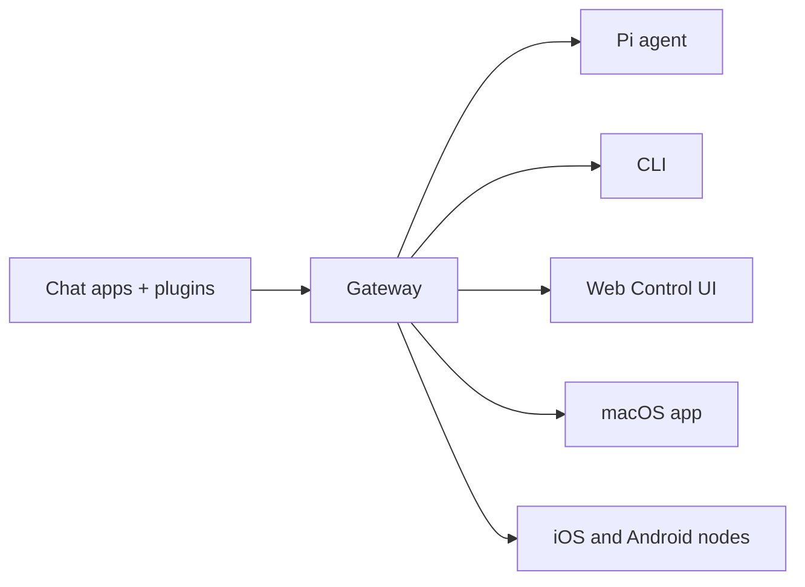

# OpenClawMU

**Multi-tenant fork of [OpenClaw](https://github.com/openclaw/openclaw)** — a self-hosted gateway that connects messaging apps (WhatsApp, Telegram, Slack, Discord, Google Chat, Signal, iMessage, Microsoft Teams, Matrix, Zalo, WebChat, and more) to AI coding agents like Pi.

> _"EXFOLIATE! EXFOLIATE!"_

OpenClawMU extends OpenClaw with enterprise-grade multi-tenancy so multiple isolated users can share a single gateway instance while keeping strict data separation.

## What OpenClawMU adds

- **Tenant Authentication** — Secure token-based auth with SHA-256 hashed storage and timing-safe comparison.
- **Data Isolation** — Separate sessions, memory, plugins, sandboxes, and config per tenant.
- **Web Terminal** — Browser-based terminal access to tenant sandboxes via xterm.js.
- **Tenant Cron** — Isolated scheduled jobs per tenant.
- **Skills & Config** — Per-tenant skill installation and configuration overlays.
- **Usage Tracking** — Token usage, cost tracking, and quota enforcement.
- **S3 Backup/Restore** — Backup tenant data to S3-compatible storage.
- **HTTP API Scoping** — OpenAI and OpenResponses endpoints scoped to tenant sessions.
- **Device/Node Pairing** — Tenant-isolated device and node pairing.

See [Multi-Tenancy](multi-tenancy/index.md) for the full breakdown.

## What is OpenClaw?

OpenClaw is a self-hosted gateway that connects your favorite chat apps to AI coding agents. You run a single Gateway process on your own machine (or a server), and it becomes the bridge between messaging apps and an always-available AI assistant.

**Who is it for?** Developers and power users who want a personal AI assistant they can message from anywhere — without giving up control of their data or relying on a hosted service.

**What makes it different?**

- **Self-hosted** — runs on your hardware, your rules.
- **Multi-channel** — one Gateway serves WhatsApp, Telegram, Discord, and more simultaneously.
- **Agent-native** — built for coding agents with tool use, sessions, memory, and multi-agent routing.
- **Open source** — MIT licensed, community-driven.

**What do you need?** Node 22+, an API key (Anthropic recommended), and a few minutes.

## How it works



The Gateway is the single source of truth for sessions, routing, and channel connections.

## Multi-Tenant quick start

```bash
# Create a tenant
openclaw tenants create demo

# Connect as tenant
OPENCLAW_GATEWAY_TOKEN="tenant:demo:xxxxx" openclaw chat
```

Full guide: [Multi-Tenancy](multi-tenancy/index.md).

## Single-user quick start

```bash
npm install -g openclaw@latest
# or: pnpm add -g openclaw@latest

openclaw onboard --install-daemon
```

The wizard installs the Gateway daemon (launchd/systemd user service) so it stays running. See [Getting Started](getting-started/index.md).

## Key capabilities

- **Local-first Gateway** — single control plane for sessions, channels, tools, and events.
- **Multi-channel inbox** — WhatsApp, Telegram, Slack, Discord, Google Chat, Signal, BlueBubbles (iMessage), iMessage (legacy), Microsoft Teams, Matrix, Zalo, Zalo Personal, WebChat, macOS, iOS/Android.
- **Multi-agent routing** — route inbound channels/accounts/peers to isolated agents (workspaces + per-agent sessions).
- **Voice Wake + Talk Mode** — always-on speech for macOS/iOS/Android with ElevenLabs.
- **Live Canvas** — agent-driven visual workspace with A2UI.
- **First-class tools** — browser, canvas, nodes, cron, sessions, and Discord/Slack actions.
- **Companion apps** — macOS menu bar app + iOS/Android nodes.
- **Onboarding + skills** — wizard-driven setup with bundled/managed/workspace skills.

## Where to next

- [Getting Started](getting-started/index.md) — install OpenClaw and bring up the Gateway.
- [Multi-Tenancy](multi-tenancy/index.md) — the OpenClawMU additions.
- [Gateway](gateway/index.md) — configuration, security, remote access.
- [Channels](channels/index.md) — per-channel setup and routing.
- [Tools & Skills](tools/index.md) — browser, skills, slash commands.
- [Nodes & Platforms](platforms/index.md) — macOS, iOS, Android nodes.
- [Concepts](concepts/index.md) — architecture, sessions, models.
- [Reference](reference/index.md) — channels, security policy, license.

Project: [github.com/neul-labs/openclawMU](https://github.com/neul-labs/openclawMU) · Upstream: [openclaw/openclaw](https://github.com/openclaw/openclaw) · MIT licensed.
